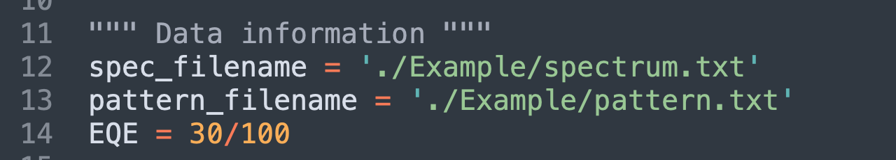
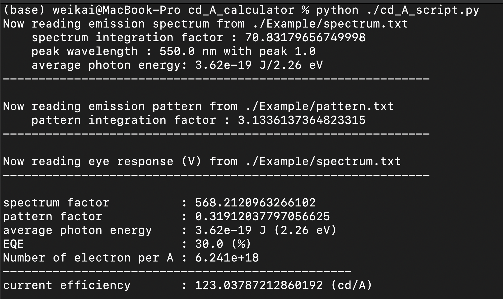

# current efficiency calculator
This module is used to calculate the current efficiency (cd/A) from the experimental results, including 

(a) spectrum at normal direction (a.u.)<br/>(b) emission pattern  (a.u.)<br/>(c) external quantum efficiency (EQE)<br/>

This module assumes that the spectra are the same at different angles. The detailed calculation method, please see method.pdf.

This module is built by python and two other third-party modules (numpy and pandas). Please install these two modules first.


```shell
pip install pandas numpy
```

or 


```shell
pip install -r requirements.txt
```


## How to execute the calculator

---

There are two main files in this module  

(a) cd_A_script.py <br/>(b) EyeResponse.txt ([Luminous efficiency function](https://en.wikipedia.org/wiki/Luminous_efficiency_function)) (Please do not modify or delete this file)

This two files should be in the same directory.

The user should open **cd_A_script.py** and specify the file names (including file paths) of the spectrum at normal direction and emission pattern as **spec_filename** and **pattern_filename**, respctively. Also, the user should give the EQE of the device as the figure shown below.

<p align="center">

</p>

### Data Format

---

#### A. Spectrum at Normal Direction

The format of the spectrum at normal direction should contain two columns. The first column is the emssion wavelength and the second column is the corresponding intensity as shown in **./Example/spectrum.txt**, which is a gaussian function peak at 550 nm with standard deviation 40 nm. 

#### B. Emission Pattern

The format of the emission pattern should contain two columns. The first column is the angle and the second column is the corresponding intensity as shown in **./Example/pattern**, which is a Lambertian distribution. 

### Execution

---

Open the command line and go into the directory of cd_A_script.py and EyeResponse.txt. Then enter


```shell
python ./cd_A_script.py
```

Then the terminal would show the spectrum information, emssion pattern information, and the calculated current efficiency [cd/A]. 

<p align="center">

</p>


